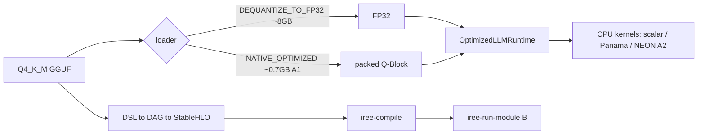
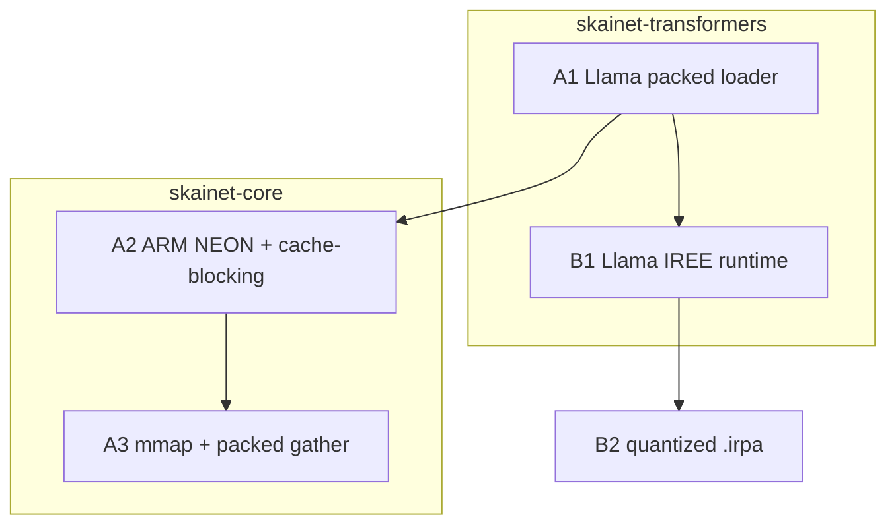
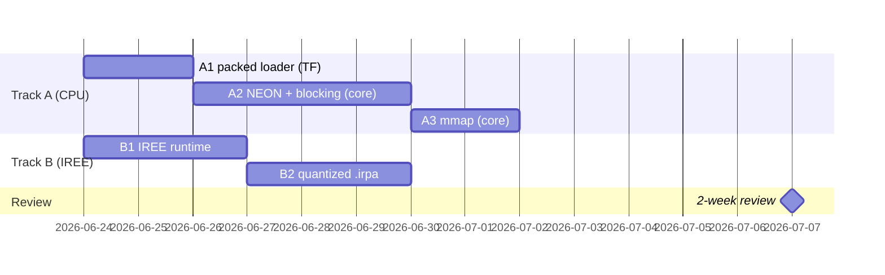

# Performance logbook — TinyLlama on SKaiNET

Trackable protocol for closing the llama.cpp gap (packed + SIMD) and the IREE path. **Every
relevant improvement = one annotated git tag + one entry here.** Roadmap:
`docs/upstream/PERF-BASELINE.md` (baseline detail) and the plan; phase log:
`docs/upstream/LLAMA-FIX-PROGRESS.md`.

## Conventions
- **Tag:** annotated, prefix `perf/` (e.g. `perf/a1-packed-llama`), in the repo where the change
  is measured end-to-end (this repo for bench-visible wins; upstream repos tagged separately).
  The tag message == the entry's What/Impact so `git tag -n` and this file agree. Cross-repo
  commits add a trailer `Perf-Tag: perf/<id>`.
- **Helper:** `scripts/perf-log.sh <id> "<title>"` runs the bench, appends an entry below + a row
  to `docs/perf-history.csv`, then (on confirm) creates `perf/<id>`.
- **Entry template:**
  ```
  ### perf/<id> — <title>  (<date>)
  - What:   one line.
  - How:    mechanism, repo @ short-sha, key files.
  - Impact: tok/s X→Y, RSS A→B vs baseline; correctness.
  - Run:    bench command + headline result.
  ```

## Latest metrics (host, TinyLlama Q4_K_M, greedy)
| variant | tok/s | RSS | correct? | tag |
|---|---|---|---|---|
| python-baseline (llama.cpp) | 98.9 | 1.23 GB | ✅ | perf/baseline-2026-06-23 |
| eager-jvm (packed + `-Xmx2g`) | **2.11** | **1.9 GB** | ✅ matches llama.cpp | perf/a1b-jvm-heap |
| eager-jvm (packed, `-Xmx12g`) | 1.80 | 5.5 GB | ✅ matches llama.cpp | perf/a1-packed-llama |
| eager-jvm (dense FP32, was baseline) | 0.17 | 8.07 GB | ✅ | perf/baseline-2026-06-23 |
Trend: `docs/perf-history.csv`.

## Pipeline (and where the gap is)


## Responsibility split + dependencies


## Schedule (review 2026-07-07)


---

# Entries (newest first)

### perf/a1b-jvm-heap — Right-size the JVM heap (RSS 5.5 → 1.9 GB)  (2026-06-23)
- What:   The packed path's 5.5 GB RSS was JVM heap *headroom* from `-Xmx12g`, not working set.
  Capping the heap closes the memory half of the llama.cpp gap.
- How:    tinyllama `bench/build.gradle.kts` `-Xmx12g → -Xmx2g` (both `application` defaults and
  the `runJvm` task). Floor probed: `-Xmx2g` runs clean, `-Xmx1536m` OOMs → ~1.6 GB true working
  set (≈0.7 GB packed weights + 0.26 GB FP32 embedding + activations/KV + JVM overhead).
- Impact: eager-jvm **RSS 5.5 → 1.9 GB** (vs llama.cpp 1.23 GB — gap mostly closed) and
  **1.80 → 2.11 tok/s** (tighter heap = less GC). Still coherent, top-10 logits == llama.cpp.
- Run:    `./gradlew -PuseLocalSkainet=true :bench:runJvm --args='bench --variants eager-jvm --tokens 16 --ctx 256 --temperature 0.01 --prompt "What is quantization?"'` → 2.11 tok/s, 1938 MB.

### perf/a1-packed-llama — Llama NATIVE_OPTIMIZED packed path (mirror Gemma)  (2026-06-23)
- What:   Packed-quant Llama eager: weights stay packed (Q4_K/Q6_K) + run the in-kernel matmul
  instead of dequantizing everything to FP32.
- How:    SKaiNET-transformers @ ccbd87e — new `LlamaQuantLayout.kt` + `LlamaPackedWeights.kt`
  (`convertLlamaWeightsPacked`: token_embd→FP32 gather, matrices→packed `Q*BlockTensorData`),
  wired into `LlamaNetworkLoader.load()` on NATIVE_OPTIMIZED. tinyllama @ 1116f9e: eager-jvm
  defaults to NATIVE_OPTIMIZED + composite `dependencySubstitution` fix (POM_ARTIFACT_ID).
- Impact: eager-jvm **0.17 → 1.80 tok/s (~10.6×)**, **8.07 → 5.5 GB**, still coherent + top-10
  logits == llama.cpp. (python-baseline 98.9 tok/s @ 1.23 GB.)
- Run:    `./gradlew -PuseLocalSkainet=true :bench:runJvm --args='bench --variants python-baseline,eager-jvm --tokens 16 --ctx 256 --temperature 0.01 --prompt "What is quantization?"'`

### perf/baseline-2026-06-23 — Starting point  (2026-06-23)
- What:   First correct SKaiNET TinyLlama inference (eager-jvm) + full measurement baseline.
- How:    eager-jvm switched to the canonical `LlamaNetworkLoader.fromGguf(DEQUANTIZE_TO_FP32).load
  + OptimizedLLMRuntime` path (matches llama.cpp). skainet-tinyllama-iree @ 9433267. Bug was our
  custom loaders, not SKaiNET. IREE: real 22-layer graph exports (1466 nodes, 0 unsupported) + vmfb.
- Impact: eager-jvm 0.17 tok/s @ 8.07 GB (correct); python-baseline 95.6 tok/s @ 1.23 GB. Gap ~570×
  — pure FP32 dequant, no packed/SIMD yet. Correctness milestone, not speed.
- Run:    `./gradlew -PuseLocalSkainet=true :bench:runJvm --args='bench --variants python-baseline,eager-jvm --tokens 16 --ctx 256 --temperature 0.01 --prompt "What is quantization?"'`
