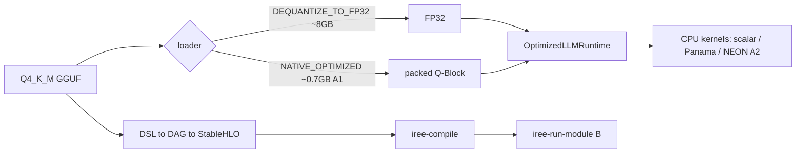
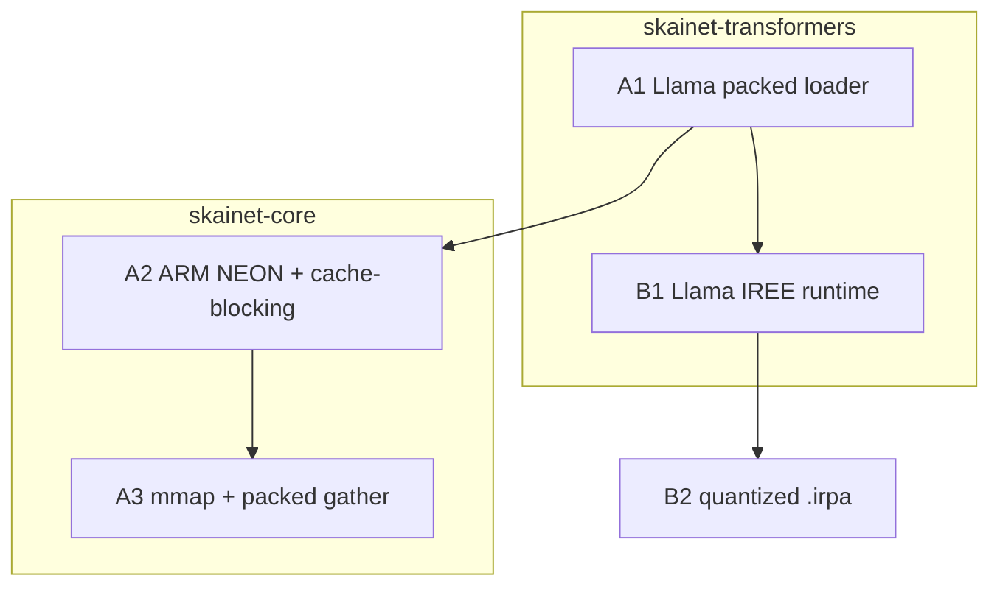
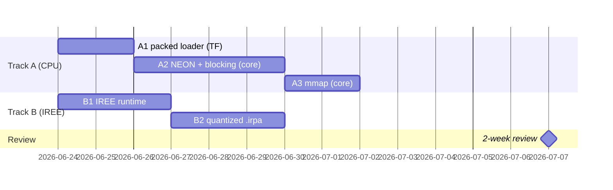

# Performance logbook — TinyLlama on SKaiNET

Trackable protocol for closing the llama.cpp gap (packed + SIMD) and the IREE path. **Every
relevant improvement = one annotated git tag + one entry here.** Roadmap:
`docs/upstream/PERF-BASELINE.md` (baseline detail) and the plan; phase log:
`docs/upstream/LLAMA-FIX-PROGRESS.md`.

## ⟳ Re-prioritization (2026-06-25): eager-on-ARM is the goal; IREE parked
The objective was always **efficient inference on ARM CPUs** (SL2619 Cortex-A55 + Apple Silicon).
IREE (Track B) was a *means*; it's now functionally complete and **parked** (B1/B2: real graph
compiles, logit parity bit-identical, int8 `.irpa` 1.1 GB fits the board, host decode validated;
on-board run pending a 3.11 board runtime — `docs/upstream/B1-IREE-COMPILE-BLOCKER.md`). **Refocus on
Track A: fast eager on ARM.**

Key finding — the NEON infra mostly already exists in `skainet-backend-native-cpu`:
- hand-written **NEON C kernels** (`q4k/q5k/q8_0/fp32_matmul.c`, guarded by `__ARM_NEON`) + aarch64
  toolchain; **Kotlin/Native cinterop wired for `linuxArm64`** (and `linuxX64`).
- the Q4_K NEON kernel **already runs on the Apple Silicon host via the JVM FFM path** (eager-jvm 3.24 tok/s).
- **GAP:** K/N `nativeMain` binds only **Q5K**; **Q4_K (135 of TinyLlama's tensors) + Q6_K (21) are
  unbound for the native board path** → board falls back to scalar (~0.009 tok/s). That's the slowdown.

Validation leverage: **Apple Silicon host == same arm64 ISA as the board**, different OS → NEON kernels
validate on BOTH (host JVM-FFM / `macosArm64` K/N, then `linuxArm64` board); two-system parity.

⚠️ Native baseline is STALE: the only `eager-native` number (~0.009 tok/s, 2026-06-22) is a single
board measurement, predates `perf/a2-fused-decode`, and there is **no host-arm64 native benchmark**
(`eager-native` runs board-only over adb). Q4_K/Q6_K still bind to scalar on K/N (only Q5_K is wired,
which TinyLlama doesn't use) — so the "scalar = slow" conclusion holds, but the number itself is stale.

Plan (Track A, refocused):
- **A2-0** add a `macosArm64` native target (+ extend K/N cinterop beyond linuxX64/linuxArm64) so
  `eager-native` benchmarks on the Apple-Silicon **host** (same arm64 ISA as the board, no adb) →
  re-baseline the current scalar state; two-system parity vs the board.
- **A2a** wire `NativeKnQ4KMatmulKernel` (mirror `NativeKnQ5KMatmulKernel`, ~56 lines) → board NEON for
  the 135 Q4_K tensors. Highest leverage / lowest effort; validate host-arm64 then board.
- **A2b** wire Q8_0 K/N (C kernel exists); add a **Q6_K** NEON C kernel + binding (21 tensors, none today).
- **A2c** build the aarch64 static archive, link the `linuxArm64` board binary, measure tok/s on the board.
- **A2d** threading (2× A55) + the landed fused-decode-attention (`perf/a2-fused-decode`); then A3 mmap.

## Conventions
- **Tag:** annotated, prefix `perf/` (e.g. `perf/a1-packed-llama`), in the repo where the change
  is measured end-to-end (this repo for bench-visible wins; upstream repos tagged separately).
  The tag message == the entry's What/Impact so `git tag -n` and this file agree. Cross-repo
  commits add a trailer `Perf-Tag: perf/<id>`.
- **Helper:** `scripts/perf-log.sh <id> "<title>"` runs the bench, appends an entry below + a row
  to `docs/perf-history.csv`, then (on confirm) creates `perf/<id>`.
- **Entry template:**
  ```
  ### perf/<id> — <title>  (<date>)
  - What:   one line.
  - How:    mechanism, repo @ short-sha, key files.
  - Impact: tok/s X→Y, RSS A→B vs baseline; correctness.
  - Run:    bench command + headline result.
  ```

## Latest metrics (host, TinyLlama Q4_K_M, greedy)
| variant | tok/s | RSS | correct? | tag |
|---|---|---|---|---|
| python-baseline (llama.cpp) | 98.9 | 1.23 GB | ✅ | perf/baseline-2026-06-23 |
| eager-jvm (streaming detok fix) | **4.27** (40-tok) | 2.1 GB | ✅ matches llama.cpp + correctly spaced | streaming-detok-spaces |
| eager-jvm (fused decode attn) | **2.77** (16-tok) / **3.82** (40-tok) | 2.1 GB | ✅ matches llama.cpp | perf/a2-fused-decode |
| eager-jvm (packed + `-Xmx2g`) | 2.11 | 1.9 GB | ✅ matches llama.cpp | perf/a1b-jvm-heap |
| eager-jvm (packed, `-Xmx12g`) | 1.80 | 5.5 GB | ✅ matches llama.cpp | perf/a1-packed-llama |
| eager-jvm (dense FP32, was baseline) | 0.17 | 8.07 GB | ✅ | perf/baseline-2026-06-23 |
Trend: `docs/perf-history.csv`.

## Pipeline (and where the gap is)


## Responsibility split + dependencies


## Schedule (review 2026-07-07)


---

# Entries (newest first)

### streaming-detok-spaces — eager-jvm output now correctly spaced; "attention bug" debunked  (2026-06-26)
- What:   The eager-jvm "spaceless" output (`theprocess`, `Quantizationis…`) was **not** an attention
  bug — it was per-token streaming **detokenization**. A generation loop calling `tokenizer.decode(id)`
  once per token applied SentencePiece's sequence-level `addSpacePrefix` leading-space strip to *every*
  token, eating each word's boundary space. Proven by experiment earlier (packed == dense-FP32 produced
  bit-identical token ids), so the model math was always correct; only the surface string was wrong.
- How:    Library-level fix, three repos, all via Maven Central (composite build removed — Maven-only):
  - **SKaiNET core 0.32.4**: new `Tokenizer.decodeToken(id)` (default `decode(intArrayOf(id))`);
    `SentencePieceTokenizer.decodeToken` decodes with `stripLeadingSpace=false`. + 2 core tests.
  - **SKaiNET-transformers 0.32.1**: `SentencePieceSpecialTokens.decode(Int)` and
    `UpstreamTokenizerAdapter.decode(Int)` route through `decodeToken`. Engine pin 0.32.2→0.32.4.
    + `SentencePieceSpecialTokensStreamingTest`. Released via annotated tag → Maven Central publish.
  - **downstream**: pins transformers 0.32.0→0.32.1, core 0.32.3→0.32.4; corrected the bench note that
    blamed a nonexistent "attention bug".
- Impact: eager-jvm **3.82 → 4.27 tok/s** (40-tok) *and* output is now coherent + correctly spaced:
  "Quantization is the process of converting a digital signal into a series of binary digits…". Fastest
  correct eager-jvm number to date (~25× over the 0.17 baseline); still ~22× behind llama.cpp's ~99 tok/s.
  NOTE: scope is the JVM streaming path. The native-host `lstlstlst…` token *collapse*
  ([[a2-host-native-bench]]) is a separate Kotlin/Native `LlamaRuntime` issue, still open.
- Run:    `./gradlew :bench:runJvm --args='bench --variants eager-jvm --tokens 40 --ctx 256 --temperature 0.01 --prompt "What is quantization?"'` → 4.27 tok/s, correct + spaced (Maven-only, no `-PuseLocalSkainet`).

### a2-host-native-bench — eager-native on Apple Silicon (host arm64) in the bench suite  (2026-06-25)
- What:   New `eager-native-host` bench variant runs the macosArm64 Kotlin/Native eager binary
  locally (no adb). A *current* native-arm64 datapoint (the board `eager-native` number was stale) +
  a host repro of the native runtime's correctness bug. Same ISA as the board, NOT board-comparable
  (macOS dispatches to Accelerate NEON+AMX; the board has neither).
- How:    `Variant.EagerNativeHost` + `runEagerNativeHost` in `:bench` (mirrors the board runner;
  reuses the same stdout parse). The `:eager` macosArm64 executable target already existed.
- Impact: First host-arm64 native measurement: **0.516 tok/s** (1.94 s/tok, 301 ms load) at
  `--tokens 8 --ctx 128`, Q4_K_M. vs board scalar 0.009 tok/s and eager-jvm 3.24 tok/s (same host).
  Output is the `lstlstlst…` collapse — the native `LlamaRuntime` attention bug, now reproducible
  on the host (no board needed to debug it). Q6_K=21/Q4_K=135 tensors; Accelerate, not the SKaiNET
  C/NEON kernels (those still need the K/N Q4_K binding — A2a).
- Run:    `./gradlew :eager:linkReleaseExecutableMacosArm64` then `./gradlew :bench:runJvm
  --args='bench --variants eager-native-host,eager-jvm --tokens 8 --ctx 128'`.

### b2-decode-loop — on-board IREE decode loop (host-validated) + IREE 3.11  (2026-06-25, Track B capability)
- What:   Greedy decode over the compiled int8 TinyLlama IREE artifact. Host loop validated; board
  (adb) script ready. All IREE tooling moved to 3.11.
- How:    Fixed-seq prefill graph has no KV cache → re-run prefill on the growing window padded to L,
  argmax the last real position (causal mask makes right-padding safe), append. `scripts/decode-iree.py`
  (`iree.runtime`, loads vmfb+`.irpa` once, loops in-process); `scripts/decode-board.sh` (adb-orchestrated,
  board runs `iree-run-module` per step). Tools: `skainet-iree:3.11.0`, Dockerfile pin 3.10→3.11.
- Impact: Generation works + correct. Prompt `[1,5462,303,291]` → `29901,1724,338,278` ("Question:
  What is the"); **int8 decode == FP32 decode (identical ids)**, FP32==eager (B1) ⇒ int8 == eager greedy.
  Board run pending a board-connected machine (board `iree-run-module` must be refreshed to 3.11).
- Run:    `python3 scripts/decode-iree.py --vmfb build/iree/int8_host.vmfb --irpa build/iree/int8.irpa
  --seqlen 8 --prompt 1,5462,303,291 --gen 4`; board: `ADB_SERIAL=… scripts/decode-board.sh
  build/iree/int8_aarch64.vmfb build/iree/int8.irpa 8 1,5462,303,291 4`.
- Next:   Run on the SL2619; then KV-cache decode-step graph (avoid O(L) re-prefill per token).

### b2-int8-irpa — int8-quantized TinyLlama IREE artifact fits the board  (2026-06-25, Track B capability)
- What:   Weight-only int8 quantization of the exported IREE artifact so it fits the 1.96 GB SL2619
  board: `.irpa` **4.2 GB → 1.1 GB**, top-10 logit parity preserved vs FP32.
- How:    `scripts/quantize-irpa.py` post-processes the FP32 export pair — 156 large rank-2 matmul
  weights → i8 globals + per-row F32 scales, dequant (`convert`+`broadcast_in_dim`+`multiply`) spliced
  at each `util.global.load`; 133 small tensors (RoPE/RMSNorm) stay F32. Then `iree-convert-parameters`
  → int8 `.irpa`, `iree-compile` → vmfb (host + aarch64 ~222 KB). IREE 3.11.
- Impact: Board-fit ACHIEVED (1.1 GB < 1.96 GB). Parity (8-token prefill vs FP32): top-1/2/3 ids+logits
  exact, all top-10 ids preserved, logits within ~0.16; only sub-0.04-logit ties reorder (ranks 4-5, 6-7).
- Run:    `python3 scripts/quantize-irpa.py build/iree/tinyllama_iree.mlir build/iree/tinyllama_weights.safetensors
  build/iree/tinyllama_iree_int8.mlir build/iree/tinyllama_weights_int8.safetensors` then convert+compile+run
  (see `docs/upstream/B1-IREE-COMPILE-BLOCKER.md` §B2). Parity harness: `scripts/parity-iree-eager.sh`.
- Next:   On-board decode loop (deploy int8 vmfb + `.irpa` to SL2619; reuse gemma-iree
  `IreeRuntime`/`GemmaDecoder`); refresh board runtime to match 3.11 host compiler.

### b1-rope-traceable — TinyLlama real graph compiles to IREE (RoPE fix)  (2026-06-25, Track B capability)
- What:   The real 22-layer TinyLlama StableHLO now compiles end-to-end to an aarch64 `.vmfb`
  (seq=2 & seq=8). Unblocks B1 — was crashing `iree-compile` since the b1-iree-export bake.
- How:    Root-caused (seqLen bisect → seq=1 OK / seq=2 crash; MLIR crash-reproducer named pass
  `iree-dispatch-creation-convert-tensor-to-flow` folding `insert_slice`→`tensor.empty()`). Cause:
  `transformer-core/RoPE.kt` interleaved RoPE used a raw-array path (`copyToFloatArray`/`fromFloatArray`)
  that under tracing freezes rotated Q/K as **disconnected constants** → GQA head-broadcast lowers to a
  const slice-into-empty cascade that segfaults the folder. Fix: new traceable `applyRoPEInterleavedOps`
  (pure tensor ops, numerically identical), gated `input.ops is KspTensorOps` so eager keeps the raw
  fast path. SKaiNET-transformers @ working tree (composite `-PuseLocalSkainet=true`).
- Impact: Compile UNBLOCKED + **logit parity CONFIRMED** (vmfb vs eager: top-10 last-pos logits
  bit-identical to 3 dp, ids in order — eager matches llama.cpp). Export 1467→2171 nodes, raw outputs
  45→1, ext params 201→289 (+88 cos/sin tables now ops). vmfb ~207 KB (seq2) / ~224 KB (seq8), 0
  unsupported. eager-jvm unchanged: coherent, 3.24 tok/s (gate stays off in eager). `LlamaDslPipelineTest` green.
- Run:    `./gradlew -PuseLocalSkainet=true :export-hlo:exportLlamaIree -Pseq=8` then
  `iree-compile build/iree/tinyllama_iree.mlir --iree-hal-target-backends=llvm-cpu
  --iree-llvmcpu-target-triple=aarch64-unknown-linux-gnu -o seq8.vmfb` → exit 0. Parity:
  `scripts/parity-iree-eager.sh`. Detail: `docs/upstream/B1-IREE-COMPILE-BLOCKER.md` (RESOLUTION).
- Next:   B2 quantized `.irpa` (4.2 GB FP32 won't fit the 1.9 GB board) + on-board decode loop
  (reuse gemma-iree `IreeRuntime`/`GemmaDecoder`).

### b1-iree-export — Value-correct TinyLlama→IREE artifact bake  (2026-06-24, Track B capability)
- What:   `:export-hlo:exportLlamaIree` bakes TinyLlama to an IREE artifact pair — a StableHLO
  MLIR whose 245 weights are lifted to `util.global` external params (func takes ONLY the token
  input) + a flat safetensors of the real weight bytes. Foundation for running TinyLlama on IREE.
- How:    New `LlamaIreeExport.kt` (tinyllama @ this commit). Mirrors the proven Gemma bake
  (RealGemmaBakeIrpaTest) but traces the **known-correct** `fromGguf(DEQUANTIZE_TO_FP32).load()`
  model (not the buggy `fromWeights` densify) under VoidTensorOps, `embedConstants=true` +
  `ConstantMaterializationPolicy.ExternalAlways(scope="model")`. `stripKvCache` first; fixed-seq
  prefill (no KV cache in graph). Weights → safetensors → `iree-convert-parameters` → `.irpa`.
- Result: 1467-node graph, **0 unsupported ops**; 245 external params (4.2 GB FP32). Op census
  confirms full attention wired: 199 dot_general, 44 exp + 22 max/sub (stable softmax), 22
  select/negate/compare (causal mask), 44 iota (RoPE), 45 sqrt (RMSNorm), 2 gather (embed).
- Run:    `./gradlew -PuseLocalSkainet=true :export-hlo:exportLlamaIree -Pseq=8` (host has 48 GB;
  task uses -Xmx32g). Artifacts: `build/iree/tinyllama_iree.mlir` + `tinyllama_weights.safetensors`.
- Progress: `iree-convert-parameters` → 4.4 GB `.irpa` ✅; synthetic 1-layer (seqLen=1) compiles
  → 24 KB vmfb ✅. **BLOCKED:** `iree-compile` crashes on the real seqLen=8 graph — null-deref in
  constant folding (`ElementsAttr::getType` during greedy canonicalize, input→flow), reproduces on
  IREE 3.7/3.10/3.11. Isolated: parse OK, seqLen=1 OK, the causal-mask pattern alone OK → it's an
  interaction in the multi-position attention subgraph. Full analysis + ranked fixes:
  `docs/upstream/B1-IREE-COMPILE-BLOCKER.md` (lead: prune dangling per-layer graph outputs to logits-only).
- Next (B1/B2): clear the compile crash → decode loop (reuse gemma-iree `IreeRuntime`/`GemmaDecoder`)
  + logit parity vs eager; then quantized `.irpa` (B2) so it fits the 1.9 GB board (4.2 GB FP32 won't).

### perf/a2-fused-decode — Fused decode-attention fast path  (2026-06-23)
- What:   The decode-path attention (seqQ==1) now runs as one buffer-direct kernel instead of
  the generic op chain. Acts on the A2 profile (matmul was never the bottleneck — attention was).
- How:    SKaiNET-transformers @ 3791f88 (`MultiHeadAttention.kt`, transformer-core). New
  `fusedDecodeAttention`: scores→softmax→GQA-weighted-V straight from the cached K/V buffers,
  emitting merged `[1, qDim]`. Bypasses `repeatKVHeads` concat (rebuilt every token×layer), the
  `unsqueeze→SDPA→squeeze→permute` chain, and the intermediate allocations those create. Same
  max-stable softmax + head→kv-head mapping as the general path → bit-for-bit-equivalent output.
  Guarded to self-attn, no sliding window; prefill (seqLen>1) keeps the general SDPA path.
- Impact: eager-jvm **2.11 → 2.77 tok/s** (16-tok headline) / **2.57 → 3.82 tok/s** (40-tok
  sustained, ~1.5×). RSS ~2.1 GB unchanged. Output identical + coherent. Gain compounds with
  generation length (KV grows; plumbing cost was per-token×layer).
- Run:    `./gradlew -PuseLocalSkainet=true :bench:runJvm --args='bench --variants eager-jvm --tokens 40 --ctx 256 --temperature 0.01 --prompt "What is quantization?"'` → 3.82 tok/s.

### a2-profile — Bottleneck is attention, not matmul  (2026-06-23, investigation)
- What:   Profiled the eager-jvm packed decode path before optimising. **The quantized matmul
  is NOT the bottleneck** — parallelising it buys only ~20%. Full write-up: `docs/upstream/A2-PROFILE.md`.
- How:    `KERNEL_DIAG=1` (kernel registry), `top -l 2` (CPU%), `jstack` ×12 (hot frames).
  Findings: (a) native-ffm Q4_K kernel (serial C, priority 100) is bundled on macOS arm64 and
  outranks the parallel Panama kernel → decode pins to ~0.8 core; (b) even parallel Panama only
  reaches ~1.1 cores; (c) jstack hot frames are attention — `MultiHeadAttention.attentionImpl`,
  `repeatKVHeads` (GQA concat/token/layer), generic per-element `DenseFloatArrayTensorData.get →
  calcFlatIndex`, and intermediate `DenseTensorDataFactory.init` allocations. No matmul frame appears.
- Impact: Re-scopes A2: original "NEON + cache-blocked GEMM" was matmul-centric. Real levers now
  ranked — (1) fused decode SDPA + buffer-direct access [core], (2) GQA without concat
  [transformer-core], (3) parallelise/de-rank serial native kernel [core]. NEON stays board-only.
- Tooling: added `KERNEL_DIAG=1` (eager) + `-PexcludeNativeCpu=true` (bench) for repeatable diagnosis.

### perf/a1b-jvm-heap — Right-size the JVM heap (RSS 5.5 → 1.9 GB)  (2026-06-23)
- What:   The packed path's 5.5 GB RSS was JVM heap *headroom* from `-Xmx12g`, not working set.
  Capping the heap closes the memory half of the llama.cpp gap.
- How:    tinyllama `bench/build.gradle.kts` `-Xmx12g → -Xmx2g` (both `application` defaults and
  the `runJvm` task). Floor probed: `-Xmx2g` runs clean, `-Xmx1536m` OOMs → ~1.6 GB true working
  set (≈0.7 GB packed weights + 0.26 GB FP32 embedding + activations/KV + JVM overhead).
- Impact: eager-jvm **RSS 5.5 → 1.9 GB** (vs llama.cpp 1.23 GB — gap mostly closed) and
  **1.80 → 2.11 tok/s** (tighter heap = less GC). Still coherent, top-10 logits == llama.cpp.
- Run:    `./gradlew -PuseLocalSkainet=true :bench:runJvm --args='bench --variants eager-jvm --tokens 16 --ctx 256 --temperature 0.01 --prompt "What is quantization?"'` → 2.11 tok/s, 1938 MB.

### perf/a1-packed-llama — Llama NATIVE_OPTIMIZED packed path (mirror Gemma)  (2026-06-23)
- What:   Packed-quant Llama eager: weights stay packed (Q4_K/Q6_K) + run the in-kernel matmul
  instead of dequantizing everything to FP32.
- How:    SKaiNET-transformers @ ccbd87e — new `LlamaQuantLayout.kt` + `LlamaPackedWeights.kt`
  (`convertLlamaWeightsPacked`: token_embd→FP32 gather, matrices→packed `Q*BlockTensorData`),
  wired into `LlamaNetworkLoader.load()` on NATIVE_OPTIMIZED. tinyllama @ 1116f9e: eager-jvm
  defaults to NATIVE_OPTIMIZED + composite `dependencySubstitution` fix (POM_ARTIFACT_ID).
- Impact: eager-jvm **0.17 → 1.80 tok/s (~10.6×)**, **8.07 → 5.5 GB**, still coherent + top-10
  logits == llama.cpp. (python-baseline 98.9 tok/s @ 1.23 GB.)
- Run:    `./gradlew -PuseLocalSkainet=true :bench:runJvm --args='bench --variants python-baseline,eager-jvm --tokens 16 --ctx 256 --temperature 0.01 --prompt "What is quantization?"'`

### perf/baseline-2026-06-23 — Starting point  (2026-06-23)
- What:   First correct SKaiNET TinyLlama inference (eager-jvm) + full measurement baseline.
- How:    eager-jvm switched to the canonical `LlamaNetworkLoader.fromGguf(DEQUANTIZE_TO_FP32).load
  + OptimizedLLMRuntime` path (matches llama.cpp). skainet-tinyllama-iree @ 9433267. Bug was our
  custom loaders, not SKaiNET. IREE: real 22-layer graph exports (1466 nodes, 0 unsupported) + vmfb.
- Impact: eager-jvm 0.17 tok/s @ 8.07 GB (correct); python-baseline 95.6 tok/s @ 1.23 GB. Gap ~570×
  — pure FP32 dequant, no packed/SIMD yet. Correctness milestone, not speed.
- Run:    `./gradlew -PuseLocalSkainet=true :bench:runJvm --args='bench --variants python-baseline,eager-jvm --tokens 16 --ctx 256 --temperature 0.01 --prompt "What is quantization?"'`
