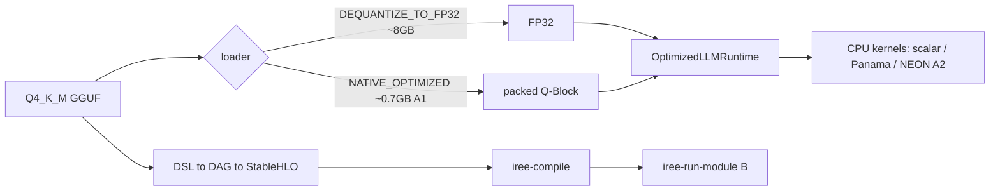
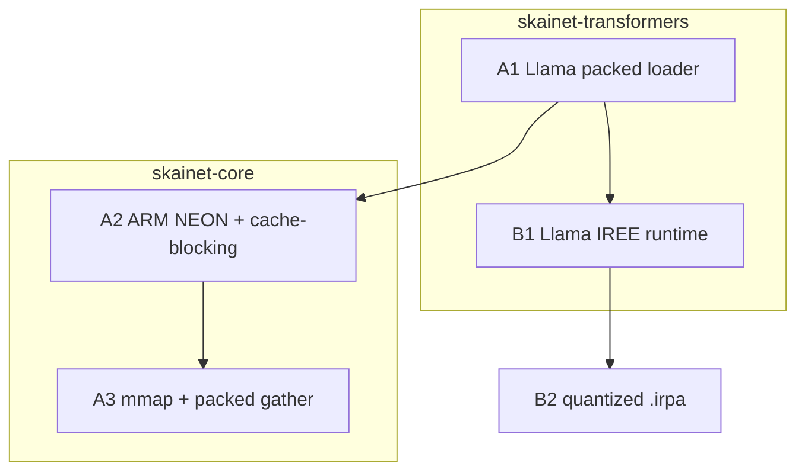
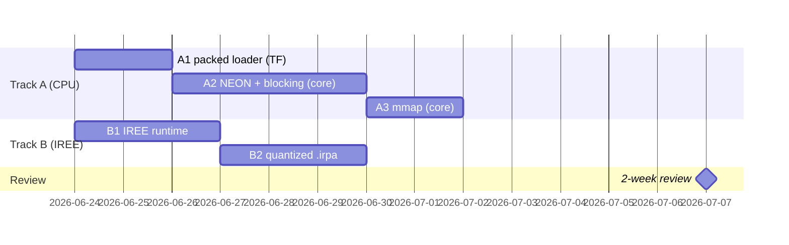

# Performance logbook — TinyLlama on SKaiNET

Trackable protocol for closing the llama.cpp gap (packed + SIMD) and the IREE path. **Every
relevant improvement = one annotated git tag + one entry here.** Roadmap:
`docs/upstream/PERF-BASELINE.md` (baseline detail) and the plan; phase log:
`docs/upstream/LLAMA-FIX-PROGRESS.md`.

## ⟳ Re-prioritization (2026-06-25): eager-on-ARM is the goal; IREE parked
The objective was always **efficient inference on ARM CPUs** (SL2619 Cortex-A55 + Apple Silicon).
IREE (Track B) was a *means*; it's now functionally complete and **parked** (B1/B2: real graph
compiles, logit parity bit-identical, int8 `.irpa` 1.1 GB fits the board, host decode validated;
on-board run pending a 3.11 board runtime — `docs/upstream/B1-IREE-COMPILE-BLOCKER.md`). **Refocus on
Track A: fast eager on ARM.**

Key finding — the NEON infra mostly already exists in `skainet-backend-native-cpu`:
- hand-written **NEON C kernels** (`q4k/q5k/q8_0/fp32_matmul.c`, guarded by `__ARM_NEON`) + aarch64
  toolchain; **Kotlin/Native cinterop wired for `linuxArm64`** (and `linuxX64`).
- the Q4_K NEON kernel **already runs on the Apple Silicon host via the JVM FFM path** (eager-jvm 3.24 tok/s).
- **GAP (mostly closed, 2026-06-26):** K/N `nativeMain` now binds **Q4_K, Q5_K, Q8_0, Q4_0**
  (`NativeKnKernelProvider.kt:41-44`). Only **Q6_K (21 of TinyLlama's tensors)** remains unbound — no
  `q6k_matmul.c` exists — so those layers still fall back to scalar on the board. Last NEON gap.

Validation leverage: **Apple Silicon host == same arm64 ISA as the board**, different OS → NEON kernels
validate on BOTH (host JVM-FFM / `macosArm64` K/N, then `linuxArm64` board); two-system parity.

✅ Native CORRECTNESS solved (2026-06-26, `native-packed-correct`): the native default is now
`fromGguf(NATIVE_OPTIMIZED) packed + OptimizedLLMRuntime` (coherent on macosArm64, 0.97 tok/s) — the
old `lstlstlst` collapse path is demoted to `EAGER_NATIVE_LEGACY=1`. The host-native number uses
Accelerate (not the SKaiNET Q-block kernels), so it is a correctness re-baseline, not the board's
kernel-bound speed — that still needs the board link (A2c).

Plan (Track A, refocused):
- ✅ **A2-0** macosArm64 native target — DONE (`a2-host-native-bench`); host-native re-baselined correct.
- ✅ **A2a** `NativeKnQ4KMatmulKernel` — DONE (Q4_K/Q8_0/Q4_0 now bound alongside Q5_K).
- **A2b** add a **Q6_K** NEON C kernel + binding (21 tensors, none today) — the last scalar fallback.
- **A2c** build the aarch64 static archive, link the `linuxArm64` board binary, measure tok/s on the board.
- **A2d** threading (2× A55) + the landed fused-decode-attention (`perf/a2-fused-decode`); then A3 mmap.

## Conventions
- **Tag:** annotated, prefix `perf/` (e.g. `perf/a1-packed-llama`), in the repo where the change
  is measured end-to-end (this repo for bench-visible wins; upstream repos tagged separately).
  The tag message == the entry's What/Impact so `git tag -n` and this file agree. Cross-repo
  commits add a trailer `Perf-Tag: perf/<id>`.
- **Helper:** `scripts/perf-log.sh <id> "<title>"` runs the bench, appends an entry below + a row
  to `docs/perf-history.csv`, then (on confirm) creates `perf/<id>`.
- **Entry template:**
  ```
  ### perf/<id> — <title>  (<date>)
  - What:   one line.
  - How:    mechanism, repo @ short-sha, key files.
  - Impact: tok/s X→Y, RSS A→B vs baseline; correctness.
  - Run:    bench command + headline result.
  ```

## Two yardsticks: HOST vs BOARD — never cross-compare them

**The llama.cpp 98.9 tok/s @ 1.23 GB number is a HOST measurement** (Apple Silicon, llama.cpp via uv;
`BenchHarness.runPythonBaseline` → `scripts/python-baseline.sh`, tagged in-code `"host llama.cpp (uv);
reference, not the board"`). The host is a beefy multi-core machine with NEON+AMX/Accelerate. **It is
NOT the board.** The real deployment target — the SL2619 **Cortex-A55** (2 in-order low-power cores,
1.92 GB RAM) — is a different, far slower class of machine. A host tok/s and a board tok/s are not
comparable, so we keep **two separate yardsticks** and always compare like-for-like:

- **HOST yardstick** = host llama.cpp (~99 tok/s). Compare host variants (eager-jvm, eager-native-host)
  to this. Use the host for fast iteration + correctness (same arm64 ISA as the board).
- **BOARD yardstick** = llama.cpp **built for and run on the A55** — *not yet measured* (no llama.cpp on
  the board today; `adb 192.168.3.26` has only `models/`). Compare the board binary (eager-native /
  linuxArm64) ONLY to this. **TODO: build aarch64 llama.cpp + measure on-board for the true yardstick.**

### Latest metrics — HOST (Apple Silicon, TinyLlama Q4_K_M, greedy)
| variant | tok/s | RSS | correct? | tag |
|---|---|---|---|---|
| **python-baseline (llama.cpp) — HOST yardstick** | 98.9 | 1.23 GB | ✅ | perf/baseline-2026-06-23 |
| eager-jvm (streaming detok fix) | **4.27** (40-tok) | 2.1 GB | ✅ matches llama.cpp + correctly spaced | streaming-detok-spaces |
| eager-native-host (canonical packed) | 0.97 (40-tok) | n/a (host) | ✅ correct (was `lstlstlst` collapse) | native-packed-correct |
| eager-native-host (**fused load+pack**) | 0.99 (40-tok) | **1.81 GB** peak (was 3.23 GB) | ✅ correct + board-fit | fused-load-pack-result |
| eager-jvm (fused decode attn) | **2.77** (16-tok) / **3.82** (40-tok) | 2.1 GB | ✅ matches llama.cpp | perf/a2-fused-decode |
| eager-jvm (packed + `-Xmx2g`) | 2.11 | 1.9 GB | ✅ matches llama.cpp | perf/a1b-jvm-heap |
| eager-jvm (packed, `-Xmx12g`) | 1.80 | 5.5 GB | ✅ matches llama.cpp | perf/a1-packed-llama |
| eager-jvm (dense FP32, was baseline) | 0.17 | 8.07 GB | ✅ | perf/baseline-2026-06-23 |

### Latest metrics — BOARD (SL2619 Cortex-A55, 2 cores, 1.92 GB)
| variant | tok/s | RSS | correct? | tag |
|---|---|---|---|---|
| **original Arm sample (llama.cpp via llama-cpp-python, on-board) — BOARD yardstick** | **2.8** (40-tok, 2 threads) | **~0.70 GB** (mmap; load Δ657 MB) | ✅ | board-llamacpp-baseline |
| eager-native (linuxArm64, **Q4_K cache-locality kernel**) | **0.184** (8-tok, 5.4 s/tok) | 1.58 GB peak | ✅ correct | perf/a2b-q4k-cache-locality |
| eager-native (linuxArm64, fused + **NEON kernels**) | 0.123 (8-tok, 8.1 s/tok) | **1.56 GB** peak | ✅ correct | board-neon-kernels |
| eager-native (linuxArm64, fused, scalar kernels) | 0.02 (8-tok, 51 s/tok) | 1.48 GB peak / 992 MB steady | ✅ correct (first board run) | board-run-fused-fits |
| eager-native (linuxArm64, un-fused) | — | OOM-killed mid-load (~1.79 GB) | ❌ | board-oom-load |

The board yardstick is **the original Arm `example_2_tinyllama` sample** (`benchmarks/python/tinyllama_benchmark.py` → `llama_cpp.Llama`), run on the A55 via the board's `fcvenv` (`llama_cpp_python 0.3.16`, `psutil`). It is **35× slower than the same sample on the host** (2.8 vs 98.9 tok/s) and uses **~0.70 GB** (llama.cpp mmaps the 668 MB GGUF). That ~0.70 GB is the memory target our fused path (host peak 1.81 GB) must approach via the mmap/layout work ([[memory-layout-architecture]]).

Trend: `docs/perf-history.csv` (the `note` column states host vs board for every row).

## Pipeline (and where the gap is)


## Responsibility split + dependencies


## Schedule (review 2026-07-07)


---

# Entries (newest first)

### perf/a2b-q4k-cache-locality — Q4_K matmul 2.07× on A55 via block-outer loop order (0.123 → 0.184 tok/s)  (2026-06-29, perf)
- **What:** rewrote `skainet_q4k_matmul` (`SKaiNET` @ `d998febe`) — (1) loop order **block-OUTER /
  output-row-INNER**, and (2) ggml-style **Q8 activation quant + integer `vdotq_s32`** dot path.
- **The real lever was memory locality, not compute.** The weight is packed block-major
  `(blockIdx*outputDim + o)*144`. The old kernel looped o-outer/block-inner, so for one output row
  consecutive blocks were `outputDim*144` ≈ **295 KB apart** (down-proj) — every weight read a cold
  miss on the in-order A55 (tiny caches, no OoO to hide it). The new order reads weight bytes
  **strictly sequentially** (stride 144 = one block; prefetch/cache-line friendly); `out[o]`
  accumulates across blocks and stays hot. Accumulation order is unchanged ⇒ numerically identical.
- **Diagnostic confirmation:** the Q8 int-dot change *alone* (committed first) showed **zero** board
  speedup (41730 → 41730 ms) despite `-march=…+dotprod` confirmed active — proof the kernel was
  memory-stall-bound, not compute-bound. Adding the loop reorder is what moved it.
- **Impact (BOARD, SL2619 A55, TinyLlama Q4_K_M, 8-tok):** Q4_K matmul **41730 → 20133 ms (2.07×)**;
  inference 65.1 → 43.4 s; decode **0.123 → 0.184 tok/s (1.50×)**, 8.1 → 5.4 s/tok. Output still
  correct ("Quantization is the process of converting a"); RSS 1579 MB (fits 1.92 GB board). Matmul
  is now ~46% of decode (was 64%) — the ~23 s non-matmul tail ([[board-decode-profile]]) is the next lever.
- **Validation:** `NativeQ4KMatmulKernelParityTest` (host JVM FFM) green against the Panama reference
  (aggregate-RMS gate, `AGG_REL_TOL=0.03` — the Q8 path is intentionally lossy ~1-3%, so per-row
  relative error is the wrong metric; the on-board generation is the end-to-end correctness gate).
- **Run:** archive built on-board (`gcc -O3 -ffast-math -march=armv8.2-a+fp16+dotprod`), pulled to the
  host cinterop path, `:eager:linkReleaseExecutableLinuxArm64` (force-relink — Gradle doesn't track
  the `.a` content), pushed via SSH, `SKAINET_PROFILE=1 … eager --model Q4_K_M --tokens 8 --temperature 0.01`.

### board-decode-profile — where the 8.1 s/token goes: 64% NEON matmul, 36% runtime overhead  (2026-06-28, investigation)
- Profiled the native decode on the board (added `KernelProfile` to `DefaultCpuOps`, timing the three
  matmul dispatch paths; opt-in via `SKAINET_PROFILE`, reset after model load). Goal: confirm the lever
  before a big kernel rewrite ([[board-neon-kernels]] left us ~22× behind board llama.cpp).
- Breakdown of the 64.9 s inference (8 tok + prefill, A55, NEON build):
  - **quant-NEON matmul: 41.5 s — 64% of inference**, 3255 calls, **100% of matmul time**.
  - **fp32-scalar: 0 calls**, generic: 0 calls — the naive FP32 triple-loop in `matmul` is NEVER hit;
    attention (Q·Kᵀ / scores·V) is computed outside `ops.matmul` (fused decode path), so it sits in…
  - **non-matmul: ~23.4 s — 36%** (attention/softmax/RoPE/RMSNorm + per-token tensor alloc / K/N GC).
- Implications (Amdahl, since matmul is only 64%):
  - **Kernel rewrite** (fuse dequant+dot, Q8 activation like ggml; matmul ~10×): 41.5 → ~4 s ⇒ total
    64.9 → **~27 s, 2.4× overall**. The biggest single lever, but bounded by the 36% tail.
  - **Threading** (2 A55 cores, matmul only): 41.5 → ~21 s ⇒ **1.5× overall**. Smaller; needs a C-kernel
    output-row-range param + native worker pool.
  - The **36% non-matmul overhead (~2.9 s/token)** is itself ~8× llama.cpp's *entire* 0.36 s token —
    likely per-token allocation/GC + runtime cost; a separate track worth its own profile.
- Decision: kernel quality first (largest lever, correctness-testable against the scalar/Panama kernels),
  then revisit the runtime overhead; threading is the smaller follow-up. The `SKAINET_PROFILE` hook stays
  for measuring each step.

### board-neon-kernels — NEON kernels active on the A55: 6.3× inference speedup (0.02 → 0.123 tok/s)  (2026-06-28, perf)
- **Root cause of the scalar-speed board run ([[board-run-fused-fits]]): the linuxArm64 binary had ZERO
  NEON kernels.** `nm` on the board binary showed 0 `skainet_*` symbols. Three reasons: (1) `eager`
  depended on `skainet-backend-native-cpu` only in `jvmMain`, so the board binary never included the NEON
  backend → it ran `ScalarKernelProvider` (priority 0, pinned by the linux CPU-ops factory); (2) the K/N
  NEON provider needs **manual registration** (`installNativeKernels()` — no ServiceLoader on native) and
  nothing called it; (3) the aarch64 archive was gated behind `-PcrossArm64` + an absent
  `aarch64-linux-gnu-gcc`, flagged "never run on the board".
- **Fix (build-on-board — no host cross-toolchain needed):**
  1. The board has native `gcc`/`make`/`cmake`/`ar` and CPU features `asimddp`+`fphp`+`asimdhp`, so
     `-march=armv8.2-a+fp16+dotprod` is safe. Compiled `libskainet_kernels.a` **on the board**, pulled it
     to the host cinterop path (`skainet-backend-native-cpu/build/native/cmake-build-arm64/`).
  2. `eager`: added `skainet-backend-native-cpu` to **`linuxArm64Main`** (not `nativeMain` — the backend
     has no macosArm64 target) + an `expect/actual installPlatformKernels()` (real on linuxArm64 →
     `installNativeKernels()`; no-op on macosArm64 which uses Accelerate), called at the top of
     `runNativeEager`.
  3. The backend wires the archive via `binaries.all { linkerOpts }` into its OWN binaries only — that
     does **not** propagate to a consumer's executable link (→ `undefined symbol: skainet_q4k_matmul`).
     Added the archive to **eager's** linuxArm64 link (composite-gated). Binary now carries the 5
     `skainet_*` symbols.
- Result (A55, 8 tok, ctx 256, same as the scalar run): **8.1 s/token (0.123 tok/s)** vs scalar
  51 s/token (0.02) → **6.3× faster**, output still correct. Peak RSS 1.56 GB (vs 1.48 GB scalar; still
  fits). Load time 232 s unchanged (pack-bound, not kernel-bound). **First time the NEON kernels have run
  on the board** — they're correct.
- vs board yardstick [[board-llamacpp-baseline]] (2.8 tok/s): now ~23× behind (was ~140×). Remaining
  levers: **(1) threading** — single-core today, the A55 has 2 (llama.cpp used 2 threads, ~2×);
  (2) kernel quality (our kernel dequants to a scratch buffer then NEON-dots; llama.cpp fuses);
  (3) the 232 s load (pack cost) dominates wall-clock but not tok/s.
- Reproducibility caveat: the archive was hand-built on the board and pulled in; it is a build artifact,
  not committed. A proper fix (propagate the static lib via the cinterop `.def`, or a working
  cross-build) should be upstreamed to core before release.

### board-run-fused-fits — FIRST correct board run: fused fix fits the A55 (1.48 GB), now speed-bound  (2026-06-27, milestone)
- **The correct path runs end-to-end on the SL2619 board for the first time.** The fused load+pack fix
  ([[fused-load-pack-result]]) is what made it possible: the un-fused path peaked 3.23 GB and
  OOM-killed mid-load ([[board-oom-load]]); the fused build's peak on the board is **1.48 GB**, which
  fits the 1.92 GB board. Memory is solved.
- Run: `linkReleaseExecutableLinuxArm64` from the composite (= fused code), pushed via
  `scripts/adb-board-run.sh`, then **detached** (`nohup … > run.log &`) so the OOM-driven adbd churn
  couldn't sever stdout; adbd `oom_score_adj=-1000` + stopped non-network services + dropped caches to
  maximize free RAM (1.82 GB free). `eager --tokens 8 --ctx 256 --temperature 0.01 --prompt "What is
  quantization?"`.
- Results (A55, 2 cores):
  - **Correct:** "Quantization is the process of converting a" — coherent, properly spaced (matches the
    board llama.cpp baseline output).
  - **Peak RSS 1.48 GB** (VmHWM sampled every 8 s; climbed gradually 0.67 → 1.48 GB then plateaued — no
    transient spike). Steady-state 992 MB. Note the board peak (1.48 GB) is *lower* than the host
    `time -l` peak (1.81 GB) — the per-tensor `GC.collect()` hint bounds the K/Native high-water on the
    board; the host figure includes a larger transient/runtime overhead.
  - **Slow: 0.02 tok/s (51 s/token), load 231 s.** vs the board yardstick
    [[board-llamacpp-baseline]] **2.8 tok/s** → ~140× behind.
- **Next frontier = SPEED, not memory.** Likely causes to check (in order): (1) are the NEON C kernels
  (`skainet-backend-native-cpu`, incl. the just-merged Q6_K) actually compiled into the linuxArm64 klib
  and bound at runtime, or is it falling back to scalar Kotlin? (2) threading — the run is effectively
  single-core; the A55 has 2. (3) the 231 s load (pack cost on the A55). The mmap/layout work also
  lowers both load time and the 992 MB steady-state toward llama.cpp's 0.70 GB.

### board-llamacpp-baseline — the REAL board yardstick: Arm sample on the A55 = 2.8 tok/s @ 0.70 GB  (2026-06-27, baseline)
- **The `python-baseline` 98.9 tok/s @ 1.23 GB is HOST-only** (Apple Silicon, `scripts/python-baseline.sh`,
  in-code note "host llama.cpp (uv); reference, not the board"). The board target — Synaptics Astra
  **SL2619, Cortex-A55, 2 cores, 1.92 GB** — is a different class of machine; a host tok/s ≠ a board
  tok/s. We now keep **two yardsticks** and compare like-for-like (see the two metrics tables above).
- **Board yardstick obtained** by running the *original Arm sample* (`example_2_tinyllama` =
  `benchmarks/python/tinyllama_benchmark.py`, `llama_cpp.Llama`) **on the board** via its `fcvenv`
  (`llama_cpp_python 0.3.16` + `psutil` already installed; model already at
  `/home/skainet-tinyllama/models/…Q4_K_M.gguf`). Cmd: `python tinyllama_benchmark.py --model <abs>
  --threads 2 --ctx 512 --tokens 40 --prompt "What is quantization?"`.
- Result (A55, 2 threads, 40 tok): **2.8 tok/s**, inference 14.3 s, **RSS ~0.70 GB** (model-load Δ 657 MB;
  llama.cpp **mmaps** the 668 MB GGUF so resident ≈ model), output correct ("Quantization is the process
  of converting a digital signal into a fixed-length binary code…").
- Implications: (1) the board is **~35× slower** than the host for the identical sample (2.8 vs 98.9) —
  always state which yardstick a number is measured against. (2) llama.cpp's **0.70 GB** board footprint
  (mmap) is the memory bar; our fused path peaks 1.81 GB on host → the mmap/layout work is what closes
  the remaining ~1.1 GB. (3) 2.8 tok/s is the speed bar for the eager-native board run (task #10).

### fused-load-pack-result — fused load+pack cuts native peak RSS 3.23 → 1.81 GB (board-fit)  (2026-06-27, result)
- **The fused load+pack works.** With a *valid* measurement path (see measurement-path fix below), the
  macosArm64 binary built from the composite (= the real fused code) vs the published un-fused 0.32.1,
  identical binary / model / canonical path (`fromGguf(NATIVE_OPTIMIZED)` + `OptimizedLLMRuntime`),
  greedy, 8–40 tok:

  | build | peak RSS (`/usr/bin/time -l`) |
  |---|---|
  | un-fused (Maven transformers 0.32.1) | **3.23 GB** |
  | fused load+pack (composite, this work) | **1.81 GB** |

  **−1.42 GB / 44% lower peak, now under the ~1.92 GB board ceiling.** Output stays correct +
  correctly spaced ("Quantization is the process of converting a digital signal into a series of binary
  digits…"). Speed 0.99 tok/s, load 12.3 s (host arm64, Accelerate). This **supersedes [[p1-result]]**'s
  "P1 did nothing / 3.23 GB unchanged" — that conclusion was an artifact of the broken measurement path,
  not the fix. The fix = fuse pack into the streaming GGUF loader (pack each tensor straight from its
  pread bytes, never materialize the full raw map) + per-tensor `GC.collect()` hint; committed on
  transformers branch `perf/llama-packed-load-memory`.
- **Measurement-path fix (the real unlock — was [[p1-result]]'s invalidator):** two bugs found & fixed
  in the downstream consume path:
  1. The composite (`-PuseLocalSkainet`) silently **never substituted transformers** — Gradle's
     auto-substitution matches included projects by `group:projectName` (`sk.ainet.transformers:kllama`)
     but they *publish* as `POM_ARTIFACT_ID` (`skainet-transformers-runtime-kllama`); names never match
     → fell through to Maven (on JVM *and* native). Fixed with **explicit `dependencySubstitution`** in
     `settings.gradle.kts` mapping each published coordinate → its `:llm-*` project path.
  2. `mavenLocal()` first in repositories served a **POM-only, JVM-jar** `kotlinx-io-core` (no Gradle
     Module Metadata, no klib) → Gradle resolved the **JVM `.jar` variant for the native compile** →
     bogus "unresolved reference 'kotlinx.io' / runBlocking / SystemFileSystem". **Removed mavenLocal**
     entirely (composite is the dev path; mavenLocal also poisons native KMP resolution and can't be
     fixed by a reload — the artifact lacks the native variant). Native now compiles the fused code clean.
- Next: linuxArm64 board link + first correct board run at this RSS (task #10). 1.81 GB is tight on a
  1.92 GB board; the strategic mmap/layout work ([[memory-layout-architecture]]) targets ~1.2 GB.

### fused-load-pack-plan — never materialize the full raw model (board OOM fix)  (2026-06-27, plan)
- Goal:   get NATIVE_OPTIMIZED Llama load peak from 3.2 GB → ~1.0 GB so the correct path runs on the
  1.92 GB SL2619 board. Root cause established in [[p1-result]]: today the loader builds the FULL raw
  tensor map (1.7 GB) then `convertLlamaWeightsPacked` builds the FULL packed map on top (3.0 GB), and
  K/N's allocator doesn't reclaim the raw pages (size-class fragmentation) → RSS = high-water.
- Approach: **fuse load+pack** — in `DecoderGgufWeightLoader.loadFromStreamingGguf`, for
  `NATIVE_OPTIMIZED` + quantized-matmul tensors, pack each tensor INLINE right after it's read and store
  ONLY the packed form (drop the raw immediately). Raw is never accumulated → peak ≈ packed-only.
- Steps (trackable tasks created this session):
  1. Factor the per-tensor pack/dequant body out of `convertLlamaWeightsPacked` into a reusable
     `packLlamaTensor(name, rawTensor, qt, metadata, ctx)` (commonMain), so loader + convert share it.
  2. Call it inline in `loadFromStreamingGguf` for NATIVE_OPTIMIZED quantized tensors; store packed via
     `onTensorLoaded`; mark these so the post-pass skips them.
  3. Make `convertLlamaWeightsPacked` a no-op for already-packed tensors (idempotent) — keeps the
     non-streaming `loadFromGguf` path working and avoids double-pack.
  4. Drop the gratuitous `copyOf` on the load path (`DenseTensorDataFactory.kt:164`) for Int8 — or route
     NATIVE_OPTIMIZED quant bytes straight into packing without the Int8 round-trip.
  5. Keep the per-tensor `gcCollectHint()` (now at the inline pack site) to free the per-tensor transient.
  6. Measure host RSS (`/usr/bin/time -l`, expect ≈ 1.0 GB) + correctness (coherent output unchanged).
  7. Build linuxArm64 (composite) → push to board → first CORRECT board tok/s (was OOM).
- Verify: host peak < ~1.2 GB AND output still "Quantization is the process of…"; board run completes
  without OOM and emits a tok/s number. eager-jvm unaffected (shared commonMain, JVM gcHint is no-op).
- Fallback if still >1.8 GB: the relayout transient or embed FP32 (256 MB) dominates → add P2 (byteOffset
  views) / P4 (packed-embedding gather) from [[zerocopy-views-analysis]].

### CORRECTION (2026-06-27): p1-result measurements were INVALID — composite didn't substitute transformers
- `:eager:dependencyInsight` proves the downstream `-PuseLocalSkainet` composite substitutes **core**
  (`sk.ainet.core:*`, via transformers' own includeBuild chain) but **NOT transformers**:
  `skainet-transformers-inference-llama` resolves to Maven **0.32.1** (`(by constraint)`, no `-> project`).
  KMP platform artifacts (`...-macosarm64:0.32.1`) come from Maven, so the includeBuild substitution
  never reaches the native transformers klib.
- Consequence: every "P1" measurement in [[p1-result]] ran the **published 0.32.1** loader, NOT my
  drain/GC-hint/fused changes — which is why all three were byte-identical 3.23 GB. **The drain/GC-hint
  changes are UNTESTED**, and "P1 doesn't help" is NOT a valid conclusion. The RSS-CURVE data (load
  phase → 1.7 GB, convert climb → 3.0 GB) is still valid — it characterizes the published code.
- Still-open task: fix the composite so transformers substitutes for native targets (or publish
  transformers to mavenLocal with a dev version + bump downstream) before re-measuring the fused fix.
  Until then the board-fit work (tasks #8–#10) is blocked on a trustworthy local build.

### p1-result — destructive drain + GC hint DON'T move the peak; it's load-phase + allocator  (2026-06-27, measurement — SEE CORRECTION ABOVE: invalid, transformers not substituted)
- What:   Implemented P1 (make `convertLlamaWeightsPacked` destructive — drain the source map per
  tensor; + a Kotlin/Native `GC.collect()` hint per tensor, mirroring `GemmaDecoder`). Re-measured the
  macosArm64 binary (composite `-PuseLocalSkainet`, default `NATIVE_OPTIMIZED`, tokens=1).
- Result: **peak RSS unchanged — 3.23 GB, byte-identical** across baseline / drain / drain+GC. P1 did
  nothing. RSS-curve sampling (`ps -o rss` @250 ms) shows WHY:
  - **Load phase** (first ~1.5 s): 0 → **1.7 GB** for a 668 MB raw model (pread + `copyOf` transients).
  - **Convert phase** (~9 s): steady climb **1.7 → 3.0 GB**; the per-tensor `GC.collect()` did NOT
    flatten it. End-of-load drops only ~400 MB → ~2.6 GB resident.
- Revised root cause: (1) the board OOM'd at 1.79 GB **during the LOAD phase**, BEFORE convert runs — so
  a convert-loop fix can't help it; (2) the convert climb persists despite map-drain + `GC.collect()`,
  i.e. **K/N's allocator does not reuse freed raw-tensor pages for the differently-sized packed
  allocations** (size-class fragmentation) → RSS tracks the high-water, not the live set. So freeing
  objects logically doesn't lower RSS here.
- Implication for the fix: lowering peak requires **never materializing the full raw model** — fuse
  load+pack so each tensor is packed straight from its pread bytes and the raw form is never stored in
  the map (only packed accumulates, ~0.9 GB). That's a `DecoderGgufWeightLoader` restructure
  (NATIVE_OPTIMIZED branch packs inline), not the commonMain convert-loop tweak P1 assumed. Plus drop
  the `copyOf` on the load path (`DenseTensorDataFactory.kt:164`) so pread bytes aren't doubled.
  Status: P1 changes (drain + GC hint) kept (harmless, correct), but insufficient alone.

### memory-layout-architecture — ggml-style layout descriptor vs ZML; design doc  (2026-06-27, design)
- Full analysis: `docs/design/memory-layout-architecture.md`. Q: can SKaiNET match llama.cpp's
  mmap+no-copy with built-in tensor layout capabilities, or go deeper (ZML buffers-as-architecture)?
- Findings: SKaiNET has the bones (Tensor/TensorData/ops separation, zero-copy `TensorView`+`IndexMapper`,
  `BufferHandle`/`MemoryChunk`/`TensorStorage`+`Placement` mmap substrate, a compile/IREE path) but 3 gaps
  force the relayout copy + heap weights: (1) **no stride/layout descriptor** (`Shape` is dims-only, no
  ggml `nb[]`); (2) **kernels are layout-fixed** (read raw ByteArray at one hardcoded block-major layout —
  can't consume a view/stride/mmap); (3) the **mmap/buffer substrate is unwired + JVM-only** (no K/N mmap).
- Verdict: full ZML (compiler-managed buffers) is the right depth for the COMPILED/IREE path (parked), NOT
  eager CPU. For eager CPU the right depth is the **ggml model**: add a LayoutSpec, make the GGUF-native
  block layout directly kernel-consumable (eliminates the relayout copy AND unlocks mmap), add a K/N mmap
  MemoryChunk + plumb BufferHandle end-to-end → llama.cpp-class memory (~1.2 GB, mmap, instant load).
- The relayout copy is a **missing-stride-descriptor symptom**, not a fundamental need.

### zerocopy-views-analysis — SKaiNET slice/view + buffer-aliasing as the OOM fix  (2026-06-27, analysis)
- What:   Analysis of SKaiNET's slice/view / zero-copy abstractions and how they cut the 3.2 GB load
  peak ([[board-oom-load]]). SKaiNET HAS the machinery; the Llama NATIVE_OPTIMIZED load path doesn't use it.
- Abstractions that exist (core, commonMain unless noted):
  - **`TensorView` / `SlicedTensorView`** (`skainet-lang-core/.../tensor/SlicedTensorView.kt`) — zero-copy
    coordinate-mapped tensor windows (no data copy; `get/set` remap into the parent).
  - **`MemoryChunk.slice(offset,len)`** (`skainet-io-core/.../io/MemoryChunk.kt`) — `ByteArrayMemoryChunk`
    returns a sub-window sharing the SAME backing array (offset+len). JVM `JvmMappedMemoryChunk.slice()`
    slices an mmap'd `MappedByteBuffer` (shares OS pages).
  - **`BufferHandle.Aliased` + `BufferHandleFactory.slice()`** (`skainet-lang-core/.../tensor/storage/`) —
    storage-level aliasing: N tensors as offset windows into ONE parent buffer.
  - **Packed quant data** (`Q4_KBlockTensorData`/Q5_K/Q6_K) stores a ByteArray **reference, no copy** —
    ready to wrap a shared buffer (needs a `byteOffset` field to be a true window).
- Where the copies actually are (per tensor, today): pread → fresh `ByteArray`; `createByteTensorData`
  does `data.copyOf()` (`DenseTensorDataFactory.kt:164`, gratuitous); `extractRawBytes` copies again
  (`LlamaPackedWeights.kt:94`); `relayoutKSeriesRowMajorToBlockMajor` allocates `ByteArray(bytes.size)`
  (`LlamaQuantLayout.kt:67`). Plus `convertLlamaWeightsPacked` holds old map + new map at once.
- What views CAN and CANNOT remove: the row-major→block-major **relayout is a genuine reorder — it must
  stay a copy** (coords don't map 1:1). Views eliminate everything else: the per-tensor pread doubling,
  the `copyOf`, and `extractRawBytes` — and let the original 668 MB stay file-backed (mmap) instead of anon.
- Gaps blocking it on the board (K/N): (1) **no K/N mmap** — need a `NativeMappedMemoryChunk` (posix
  `mmap` via cinterop) or a single-pread shared buffer; (2) `TensorStorageFactory.extractBytes()` doesn't
  handle `BufferHandle.Aliased` (throws); (3) `Q4_KBlockTensorData` has no `byteOffset` (can't window).
- Phased fix (cheap→deep): **P1** make `convertLlamaWeightsPacked` destructive (drain source map per
  tensor; free relayout input) + drop the `copyOf` → kills old+new doubling, pure commonMain, fits the
  board (target ≈ 1.2–1.4 GB). **P2** add `byteOffset` to packed quant data + wire `Aliased` in
  `extractBytes` + single-shared-GGUF-buffer slices → removes per-tensor copies (≈ 1.0 GB). **P3** K/N
  `mmap` source → original weights file-backed, true zero-copy (≈ 0.9 GB). **P4** keep token_embd packed
  (−256 MB, needs packed-embedding gather). Relayout copy is irreducible (one tensor transient).

### board-oom-load — board run OOMs on load; NATIVE_OPTIMIZED peaks 3.2 GB (transient doubling)  (2026-06-27, investigation)
- What:   First end-to-end board run of the *correct* path (SL2619 Cortex-A55, 2 cores, **1.92 GB**,
  network adb `192.168.3.26:5555`). Build→push→run mechanics work (K/N links linuxArm64 with no
  cross-gcc), but the process is **OOM-killed during model load**: kernel log shows `tinyllama-skain`
  at **RSS ~1.79 GB** (458 219 pages × 4 KB) before the OOM killer fires (avahi/systemd leave ~1.8 GB
  available). No tokens produced.
- Measure: host peak RSS (`/usr/bin/time -l`, tokens=1, ctx=128) — `NATIVE_OPTIMIZED` **3.23 GB**
  (3 232 546 816 B); `DEQUANTIZE_TO_FP32` **8.95 GB**. For a 668 MB Q4_K_M file, 3.2 GB is ~5×.
- Root cause: **transient doubling in `convertLlamaWeightsPacked`** (SKaiNET-transformers
  `llm-inference/llama/.../LlamaPackedWeights.kt:35-64`): the loop holds the **original** tensor map
  (~668 MB packed) AND builds the **new** relaid map (~665 MB packed + **256 MB FP32 token embeddings**,
  `dequantNoTranspose`) at the same time; `relayoutKSeriesRowMajorToBlockMajor`
  (`LlamaQuantLayout.kt:67`) allocates a fresh `ByteArray(bytes.size)` per tensor (the row-major→
  block-major reorder is an unavoidable copy); originals aren't freed until the function returns.
  Peak ≈ old + new + relayout-transient + GC-lag ≈ 3.2 GB. Steady-state after load is only ~0.9–1.0 GB —
  it's the **load-time peak** that OOMs, not the resident model.
- Zero-copy audit (user pointer "skainet provides zero-copy GGUF"): TRUE on **JVM only** —
  `MappedRandomAccessSource` (FileChannel.map), `MmapTensorData`/`MmapFloatTensorData`,
  `Q4KMemSegMatmulKernel`/`MemSegKernelProvider`, `MmapLlamaLoader`. BUT `MmapLlamaLoader` is **FP32-only**
  (no quantized mmap), and the whole MemSeg/mmap surface is `java.lang.foreign` → **JVM-only**. On
  **Kotlin/Native (the board)** there is **no mmap** — `createRandomAccessSource` →
  `PosixPreadRandomAccessSource` (pread into a fresh `ByteArray`), and `NATIVE_OPTIMIZED` produces heap
  `Q4_KBlockTensorData`. So the board cannot use the existing zero-copy path as-is.
- Fix plan: **(A)** make `convertLlamaWeightsPacked` **destructive/streaming** — drop each source tensor
  as it's converted and free the relayout input promptly → kills the old+new doubling (commonMain, works
  on K/N; target peak ≈ ~1.2–1.4 GB). **(B, deeper)** add a Kotlin/Native posix-`mmap` RandomAccessSource
  + file-backed packed `TensorData` so the original 668 MB stays file-backed → true zero-copy on the board
  (target ≈ ~0.9 GB). **(C)** keep token embeddings packed (save 256 MB) — needs a packed-embedding gather.
- Run:    `ADB_SERIAL=192.168.3.26:5555 bash scripts/adb-board-run.sh eager --model /home/skainet-tinyllama/models/tinyllama-1.1b-chat-v1.0.Q4_K_M.gguf --tokens 8 --ctx 128` → OOM-killed mid-load.

### native-packed-correct — native (board) path now CORRECT; canonical packed runtime is default  (2026-06-26)
- What:   The Kotlin/Native eager path (board target) no longer collapses to `lstlstlst…`. The native
  binary's **default** is now `fromGguf(NATIVE_OPTIMIZED) packed + OptimizedLLMRuntime` — the same
  canonical runtime the correct eager-jvm uses — producing coherent, correctly-spaced output on
  macosArm64: "Quantization is the process of converting a digital signal…". Correctness gate passed.
- How:    `EagerNative.kt` (`eager/src/nativeMain/...`) default-path switch flipped: drop the
  `EAGER_NATIVE_FP32` gate; default = `NATIVE_OPTIMIZED` packed + `OptimizedLLMRuntime`. The bespoke
  `loadPackedGgufLlamaWeights` + deprecated `LlamaRuntime` + `CpuAttentionBackend` collapse path is
  demoted to `EAGER_NATIVE_LEGACY=1` (debug only); `EAGER_NATIVE_FP32=1` keeps the FP32 parity path.
  The old `gather: unsupported input rank 1` packed blocker is fixed upstream (transformers ≥0.32.0).
- Impact: native-host (macosArm64, Accelerate NEON+AMX) **correct** at **0.97 tok/s** (1.0 s/tok,
  ~10.5 s load) — a fresh CORRECT re-baseline replacing the stale 0.516 *collapse* number. Not yet
  fast (host-native via Accelerate, no SKaiNET Q-block kernels here) and not board-comparable, but the
  board now has a coherent runtime to build perf on. RSS unmeasured on host (`rssMb()` reads Linux
  `/proc/self/statm`; valid on the board). eager-jvm unchanged (shared canonical path): 4.27 tok/s.
- Run:    `./gradlew :eager:linkReleaseExecutableMacosArm64` then
  `./eager/build/bin/macosArm64/releaseExecutable/tinyllama-skainet.kexe eager --tokens 40 --ctx 256 --temperature 0.01 --prompt "What is quantization?"` → coherent, 0.97 tok/s.

### streaming-detok-spaces — eager-jvm output now correctly spaced; "attention bug" debunked  (2026-06-26)
- What:   The eager-jvm "spaceless" output (`theprocess`, `Quantizationis…`) was **not** an attention
  bug — it was per-token streaming **detokenization**. A generation loop calling `tokenizer.decode(id)`
  once per token applied SentencePiece's sequence-level `addSpacePrefix` leading-space strip to *every*
  token, eating each word's boundary space. Proven by experiment earlier (packed == dense-FP32 produced
  bit-identical token ids), so the model math was always correct; only the surface string was wrong.
- How:    Library-level fix, three repos, all via Maven Central (composite build removed — Maven-only):
  - **SKaiNET core 0.32.4**: new `Tokenizer.decodeToken(id)` (default `decode(intArrayOf(id))`);
    `SentencePieceTokenizer.decodeToken` decodes with `stripLeadingSpace=false`. + 2 core tests.
  - **SKaiNET-transformers 0.32.1**: `SentencePieceSpecialTokens.decode(Int)` and
    `UpstreamTokenizerAdapter.decode(Int)` route through `decodeToken`. Engine pin 0.32.2→0.32.4.
    + `SentencePieceSpecialTokensStreamingTest`. Released via annotated tag → Maven Central publish.
  - **downstream**: pins transformers 0.32.0→0.32.1, core 0.32.3→0.32.4; corrected the bench note that
    blamed a nonexistent "attention bug".
- Impact: eager-jvm **3.82 → 4.27 tok/s** (40-tok) *and* output is now coherent + correctly spaced:
  "Quantization is the process of converting a digital signal into a series of binary digits…". Fastest
  correct eager-jvm number to date (~25× over the 0.17 baseline); still ~22× behind llama.cpp's ~99 tok/s.
  NOTE: scope is the JVM streaming path. The native-host `lstlstlst…` token *collapse*
  ([[a2-host-native-bench]]) is a separate Kotlin/Native `LlamaRuntime` issue, still open.
- Run:    `./gradlew :bench:runJvm --args='bench --variants eager-jvm --tokens 40 --ctx 256 --temperature 0.01 --prompt "What is quantization?"'` → 4.27 tok/s, correct + spaced (Maven-only, no `-PuseLocalSkainet`).

### a2-host-native-bench — eager-native on Apple Silicon (host arm64) in the bench suite  (2026-06-25)
- What:   New `eager-native-host` bench variant runs the macosArm64 Kotlin/Native eager binary
  locally (no adb). A *current* native-arm64 datapoint (the board `eager-native` number was stale) +
  a host repro of the native runtime's correctness bug. Same ISA as the board, NOT board-comparable
  (macOS dispatches to Accelerate NEON+AMX; the board has neither).
- How:    `Variant.EagerNativeHost` + `runEagerNativeHost` in `:bench` (mirrors the board runner;
  reuses the same stdout parse). The `:eager` macosArm64 executable target already existed.
- Impact: First host-arm64 native measurement: **0.516 tok/s** (1.94 s/tok, 301 ms load) at
  `--tokens 8 --ctx 128`, Q4_K_M. vs board scalar 0.009 tok/s and eager-jvm 3.24 tok/s (same host).
  Output is the `lstlstlst…` collapse — the native `LlamaRuntime` attention bug, now reproducible
  on the host (no board needed to debug it). Q6_K=21/Q4_K=135 tensors; Accelerate, not the SKaiNET
  C/NEON kernels (those still need the K/N Q4_K binding — A2a).
- Run:    `./gradlew :eager:linkReleaseExecutableMacosArm64` then `./gradlew :bench:runJvm
  --args='bench --variants eager-native-host,eager-jvm --tokens 8 --ctx 128'`.

### b2-decode-loop — on-board IREE decode loop (host-validated) + IREE 3.11  (2026-06-25, Track B capability)
- What:   Greedy decode over the compiled int8 TinyLlama IREE artifact. Host loop validated; board
  (adb) script ready. All IREE tooling moved to 3.11.
- How:    Fixed-seq prefill graph has no KV cache → re-run prefill on the growing window padded to L,
  argmax the last real position (causal mask makes right-padding safe), append. `scripts/decode-iree.py`
  (`iree.runtime`, loads vmfb+`.irpa` once, loops in-process); `scripts/decode-board.sh` (adb-orchestrated,
  board runs `iree-run-module` per step). Tools: `skainet-iree:3.11.0`, Dockerfile pin 3.10→3.11.
- Impact: Generation works + correct. Prompt `[1,5462,303,291]` → `29901,1724,338,278` ("Question:
  What is the"); **int8 decode == FP32 decode (identical ids)**, FP32==eager (B1) ⇒ int8 == eager greedy.
  Board run pending a board-connected machine (board `iree-run-module` must be refreshed to 3.11).
- Run:    `python3 scripts/decode-iree.py --vmfb build/iree/int8_host.vmfb --irpa build/iree/int8.irpa
  --seqlen 8 --prompt 1,5462,303,291 --gen 4`; board: `ADB_SERIAL=… scripts/decode-board.sh
  build/iree/int8_aarch64.vmfb build/iree/int8.irpa 8 1,5462,303,291 4`.
- Next:   Run on the SL2619; then KV-cache decode-step graph (avoid O(L) re-prefill per token).

### b2-int8-irpa — int8-quantized TinyLlama IREE artifact fits the board  (2026-06-25, Track B capability)
- What:   Weight-only int8 quantization of the exported IREE artifact so it fits the 1.96 GB SL2619
  board: `.irpa` **4.2 GB → 1.1 GB**, top-10 logit parity preserved vs FP32.
- How:    `scripts/quantize-irpa.py` post-processes the FP32 export pair — 156 large rank-2 matmul
  weights → i8 globals + per-row F32 scales, dequant (`convert`+`broadcast_in_dim`+`multiply`) spliced
  at each `util.global.load`; 133 small tensors (RoPE/RMSNorm) stay F32. Then `iree-convert-parameters`
  → int8 `.irpa`, `iree-compile` → vmfb (host + aarch64 ~222 KB). IREE 3.11.
- Impact: Board-fit ACHIEVED (1.1 GB < 1.96 GB). Parity (8-token prefill vs FP32): top-1/2/3 ids+logits
  exact, all top-10 ids preserved, logits within ~0.16; only sub-0.04-logit ties reorder (ranks 4-5, 6-7).
- Run:    `python3 scripts/quantize-irpa.py build/iree/tinyllama_iree.mlir build/iree/tinyllama_weights.safetensors
  build/iree/tinyllama_iree_int8.mlir build/iree/tinyllama_weights_int8.safetensors` then convert+compile+run
  (see `docs/upstream/B1-IREE-COMPILE-BLOCKER.md` §B2). Parity harness: `scripts/parity-iree-eager.sh`.
- Next:   On-board decode loop (deploy int8 vmfb + `.irpa` to SL2619; reuse gemma-iree
  `IreeRuntime`/`GemmaDecoder`); refresh board runtime to match 3.11 host compiler.

### b1-rope-traceable — TinyLlama real graph compiles to IREE (RoPE fix)  (2026-06-25, Track B capability)
- What:   The real 22-layer TinyLlama StableHLO now compiles end-to-end to an aarch64 `.vmfb`
  (seq=2 & seq=8). Unblocks B1 — was crashing `iree-compile` since the b1-iree-export bake.
- How:    Root-caused (seqLen bisect → seq=1 OK / seq=2 crash; MLIR crash-reproducer named pass
  `iree-dispatch-creation-convert-tensor-to-flow` folding `insert_slice`→`tensor.empty()`). Cause:
  `transformer-core/RoPE.kt` interleaved RoPE used a raw-array path (`copyToFloatArray`/`fromFloatArray`)
  that under tracing freezes rotated Q/K as **disconnected constants** → GQA head-broadcast lowers to a
  const slice-into-empty cascade that segfaults the folder. Fix: new traceable `applyRoPEInterleavedOps`
  (pure tensor ops, numerically identical), gated `input.ops is KspTensorOps` so eager keeps the raw
  fast path. SKaiNET-transformers @ working tree (composite `-PuseLocalSkainet=true`).
- Impact: Compile UNBLOCKED + **logit parity CONFIRMED** (vmfb vs eager: top-10 last-pos logits
  bit-identical to 3 dp, ids in order — eager matches llama.cpp). Export 1467→2171 nodes, raw outputs
  45→1, ext params 201→289 (+88 cos/sin tables now ops). vmfb ~207 KB (seq2) / ~224 KB (seq8), 0
  unsupported. eager-jvm unchanged: coherent, 3.24 tok/s (gate stays off in eager). `LlamaDslPipelineTest` green.
- Run:    `./gradlew -PuseLocalSkainet=true :export-hlo:exportLlamaIree -Pseq=8` then
  `iree-compile build/iree/tinyllama_iree.mlir --iree-hal-target-backends=llvm-cpu
  --iree-llvmcpu-target-triple=aarch64-unknown-linux-gnu -o seq8.vmfb` → exit 0. Parity:
  `scripts/parity-iree-eager.sh`. Detail: `docs/upstream/B1-IREE-COMPILE-BLOCKER.md` (RESOLUTION).
- Next:   B2 quantized `.irpa` (4.2 GB FP32 won't fit the 1.9 GB board) + on-board decode loop
  (reuse gemma-iree `IreeRuntime`/`GemmaDecoder`).

### b1-iree-export — Value-correct TinyLlama→IREE artifact bake  (2026-06-24, Track B capability)
- What:   `:export-hlo:exportLlamaIree` bakes TinyLlama to an IREE artifact pair — a StableHLO
  MLIR whose 245 weights are lifted to `util.global` external params (func takes ONLY the token
  input) + a flat safetensors of the real weight bytes. Foundation for running TinyLlama on IREE.
- How:    New `LlamaIreeExport.kt` (tinyllama @ this commit). Mirrors the proven Gemma bake
  (RealGemmaBakeIrpaTest) but traces the **known-correct** `fromGguf(DEQUANTIZE_TO_FP32).load()`
  model (not the buggy `fromWeights` densify) under VoidTensorOps, `embedConstants=true` +
  `ConstantMaterializationPolicy.ExternalAlways(scope="model")`. `stripKvCache` first; fixed-seq
  prefill (no KV cache in graph). Weights → safetensors → `iree-convert-parameters` → `.irpa`.
- Result: 1467-node graph, **0 unsupported ops**; 245 external params (4.2 GB FP32). Op census
  confirms full attention wired: 199 dot_general, 44 exp + 22 max/sub (stable softmax), 22
  select/negate/compare (causal mask), 44 iota (RoPE), 45 sqrt (RMSNorm), 2 gather (embed).
- Run:    `./gradlew -PuseLocalSkainet=true :export-hlo:exportLlamaIree -Pseq=8` (host has 48 GB;
  task uses -Xmx32g). Artifacts: `build/iree/tinyllama_iree.mlir` + `tinyllama_weights.safetensors`.
- Progress: `iree-convert-parameters` → 4.4 GB `.irpa` ✅; synthetic 1-layer (seqLen=1) compiles
  → 24 KB vmfb ✅. **BLOCKED:** `iree-compile` crashes on the real seqLen=8 graph — null-deref in
  constant folding (`ElementsAttr::getType` during greedy canonicalize, input→flow), reproduces on
  IREE 3.7/3.10/3.11. Isolated: parse OK, seqLen=1 OK, the causal-mask pattern alone OK → it's an
  interaction in the multi-position attention subgraph. Full analysis + ranked fixes:
  `docs/upstream/B1-IREE-COMPILE-BLOCKER.md` (lead: prune dangling per-layer graph outputs to logits-only).
- Next (B1/B2): clear the compile crash → decode loop (reuse gemma-iree `IreeRuntime`/`GemmaDecoder`)
  + logit parity vs eager; then quantized `.irpa` (B2) so it fits the 1.9 GB board (4.2 GB FP32 won't).

### perf/a2-fused-decode — Fused decode-attention fast path  (2026-06-23)
- What:   The decode-path attention (seqQ==1) now runs as one buffer-direct kernel instead of
  the generic op chain. Acts on the A2 profile (matmul was never the bottleneck — attention was).
- How:    SKaiNET-transformers @ 3791f88 (`MultiHeadAttention.kt`, transformer-core). New
  `fusedDecodeAttention`: scores→softmax→GQA-weighted-V straight from the cached K/V buffers,
  emitting merged `[1, qDim]`. Bypasses `repeatKVHeads` concat (rebuilt every token×layer), the
  `unsqueeze→SDPA→squeeze→permute` chain, and the intermediate allocations those create. Same
  max-stable softmax + head→kv-head mapping as the general path → bit-for-bit-equivalent output.
  Guarded to self-attn, no sliding window; prefill (seqLen>1) keeps the general SDPA path.
- Impact: eager-jvm **2.11 → 2.77 tok/s** (16-tok headline) / **2.57 → 3.82 tok/s** (40-tok
  sustained, ~1.5×). RSS ~2.1 GB unchanged. Output identical + coherent. Gain compounds with
  generation length (KV grows; plumbing cost was per-token×layer).
- Run:    `./gradlew -PuseLocalSkainet=true :bench:runJvm --args='bench --variants eager-jvm --tokens 40 --ctx 256 --temperature 0.01 --prompt "What is quantization?"'` → 3.82 tok/s.

### a2-profile — Bottleneck is attention, not matmul  (2026-06-23, investigation)
- What:   Profiled the eager-jvm packed decode path before optimising. **The quantized matmul
  is NOT the bottleneck** — parallelising it buys only ~20%. Full write-up: `docs/upstream/A2-PROFILE.md`.
- How:    `KERNEL_DIAG=1` (kernel registry), `top -l 2` (CPU%), `jstack` ×12 (hot frames).
  Findings: (a) native-ffm Q4_K kernel (serial C, priority 100) is bundled on macOS arm64 and
  outranks the parallel Panama kernel → decode pins to ~0.8 core; (b) even parallel Panama only
  reaches ~1.1 cores; (c) jstack hot frames are attention — `MultiHeadAttention.attentionImpl`,
  `repeatKVHeads` (GQA concat/token/layer), generic per-element `DenseFloatArrayTensorData.get →
  calcFlatIndex`, and intermediate `DenseTensorDataFactory.init` allocations. No matmul frame appears.
- Impact: Re-scopes A2: original "NEON + cache-blocked GEMM" was matmul-centric. Real levers now
  ranked — (1) fused decode SDPA + buffer-direct access [core], (2) GQA without concat
  [transformer-core], (3) parallelise/de-rank serial native kernel [core]. NEON stays board-only.
- Tooling: added `KERNEL_DIAG=1` (eager) + `-PexcludeNativeCpu=true` (bench) for repeatable diagnosis.

### perf/a1b-jvm-heap — Right-size the JVM heap (RSS 5.5 → 1.9 GB)  (2026-06-23)
- What:   The packed path's 5.5 GB RSS was JVM heap *headroom* from `-Xmx12g`, not working set.
  Capping the heap closes the memory half of the llama.cpp gap.
- How:    tinyllama `bench/build.gradle.kts` `-Xmx12g → -Xmx2g` (both `application` defaults and
  the `runJvm` task). Floor probed: `-Xmx2g` runs clean, `-Xmx1536m` OOMs → ~1.6 GB true working
  set (≈0.7 GB packed weights + 0.26 GB FP32 embedding + activations/KV + JVM overhead).
- Impact: eager-jvm **RSS 5.5 → 1.9 GB** (vs llama.cpp 1.23 GB — gap mostly closed) and
  **1.80 → 2.11 tok/s** (tighter heap = less GC). Still coherent, top-10 logits == llama.cpp.
- Run:    `./gradlew -PuseLocalSkainet=true :bench:runJvm --args='bench --variants eager-jvm --tokens 16 --ctx 256 --temperature 0.01 --prompt "What is quantization?"'` → 2.11 tok/s, 1938 MB.

### perf/a1-packed-llama — Llama NATIVE_OPTIMIZED packed path (mirror Gemma)  (2026-06-23)
- What:   Packed-quant Llama eager: weights stay packed (Q4_K/Q6_K) + run the in-kernel matmul
  instead of dequantizing everything to FP32.
- How:    SKaiNET-transformers @ ccbd87e — new `LlamaQuantLayout.kt` + `LlamaPackedWeights.kt`
  (`convertLlamaWeightsPacked`: token_embd→FP32 gather, matrices→packed `Q*BlockTensorData`),
  wired into `LlamaNetworkLoader.load()` on NATIVE_OPTIMIZED. tinyllama @ 1116f9e: eager-jvm
  defaults to NATIVE_OPTIMIZED + composite `dependencySubstitution` fix (POM_ARTIFACT_ID).
- Impact: eager-jvm **0.17 → 1.80 tok/s (~10.6×)**, **8.07 → 5.5 GB**, still coherent + top-10
  logits == llama.cpp. (python-baseline 98.9 tok/s @ 1.23 GB.)
- Run:    `./gradlew -PuseLocalSkainet=true :bench:runJvm --args='bench --variants python-baseline,eager-jvm --tokens 16 --ctx 256 --temperature 0.01 --prompt "What is quantization?"'`

### perf/baseline-2026-06-23 — Starting point  (2026-06-23)
- What:   First correct SKaiNET TinyLlama inference (eager-jvm) + full measurement baseline.
- How:    eager-jvm switched to the canonical `LlamaNetworkLoader.fromGguf(DEQUANTIZE_TO_FP32).load
  + OptimizedLLMRuntime` path (matches llama.cpp). skainet-tinyllama-iree @ 9433267. Bug was our
  custom loaders, not SKaiNET. IREE: real 22-layer graph exports (1466 nodes, 0 unsupported) + vmfb.
- Impact: eager-jvm 0.17 tok/s @ 8.07 GB (correct); python-baseline 95.6 tok/s @ 1.23 GB. Gap ~570×
  — pure FP32 dequant, no packed/SIMD yet. Correctness milestone, not speed.
- Run:    `./gradlew -PuseLocalSkainet=true :bench:runJvm --args='bench --variants python-baseline,eager-jvm --tokens 16 --ctx 256 --temperature 0.01 --prompt "What is quantization?"'`
